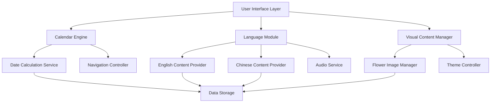

# Design Document: Multilingual Calendar 2026

## Overview

The Multilingual Calendar 2026 is a web-based application that combines a functional calendar display with language learning features for English and Chinese, enhanced with beautiful Portuguese flower imagery. The application will be built using HTML, CSS, and JavaScript to create a responsive, interactive experience that serves both practical calendar needs and educational purposes.

The system integrates three core components: a calendar display engine, a multilingual content management system, and a visual enhancement layer featuring seasonal Portuguese flowers. Users can navigate through 2026's months while accessing daily learning content including quotes, fun facts, vocabulary, and cultural information about Chinese holidays and traditions.

## Architecture

The application follows a modular architecture with clear separation of concerns:



### Core Components

1. **Calendar Engine**: Handles date calculations, month navigation, and calendar grid generation
2. **Language Module**: Manages multilingual content delivery and learning features
3. **Visual Content Manager**: Controls flower imagery and visual themes
4. **Data Storage**: Contains all content data including quotes, facts, holidays, and flower information

## Components and Interfaces

### Calendar Engine

**CalendarEngine Class**
```javascript
class CalendarEngine {
  constructor(year = 2026)
  generateMonthGrid(month, year)
  navigateToMonth(month, year)
  getCurrentDate()
  isWeekend(date)
  isHoliday(date)
}
```

**Responsibilities:**
- Generate accurate calendar grids for any month in 2026
- Handle navigation between months with smooth transitions
- Identify weekends, holidays, and special dates
- Provide date calculation utilities

### Language Module

**LanguageModule Class**
```javascript
class LanguageModule {
  getQuoteOfTheDay(date)
  getFunFact(date)
  getChineseHoliday(date)
  getVocabulary(context)
  playAudio(text, language)
  getTranslation(text, targetLanguage)
}
```

**Content Providers:**
- **EnglishContentProvider**: Manages quotes, fun facts, vocabulary, and pronunciation
- **ChineseContentProvider**: Handles Chinese characters, pinyin, cultural information, and holidays
- **AudioService**: Provides text-to-speech functionality for pronunciation practice

### Visual Content Manager

**FlowerImageManager Class**
```javascript
class FlowerImageManager {
  getMonthlyFlower(month)
  getFlowerInfo(flowerName)
  preloadImages()
  applySeasonalTheme(month)
}
```

**Monthly Flower Mapping:**
- January: Camellia (Camélia) - Winter elegance
- February: Almond Blossom (Flor de Amendoeira) - Early spring hope
- March: Daffodil (Narciso) - Spring awakening
- April: Cherry Blossom (Flor de Cerejeira) - Renewal and beauty
- May: Rose (Rosa) - Classic Portuguese gardens
- June: Lavender (Alfazema) - Summer fragrance
- July: Sunflower (Girassol) - Summer brightness
- August: Bougainvillea (Buganvília) - Mediterranean warmth
- September: Dahlia (Dália) - Autumn richness
- October: Chrysanthemum (Crisântemo) - Fall tradition
- November: Cyclamen (Ciclâmen) - Late autumn beauty
- December: Poinsettia (Bico-de-papagaio) - Holiday celebration

## Data Models

### Date Model
```javascript
class CalendarDate {
  constructor(day, month, year) {
    this.day = day;
    this.month = month;
    this.year = year;
    this.isWeekend = this.calculateWeekend();
    this.isHoliday = this.checkHoliday();
  }
}
```

### Learning Content Model
```javascript
class DailyContent {
  constructor(date) {
    this.date = date;
    this.englishQuote = "";
    this.funFact = "";
    this.vocabulary = [];
    this.chineseHoliday = null;
    this.pronunciation = {};
  }
}
```

### Chinese Holiday Model
```javascript
class ChineseHoliday {
  constructor(name, date, description, traditions) {
    this.name = {
      chinese: "",
      pinyin: "",
      english: ""
    };
    this.date = date;
    this.description = description;
    this.traditions = traditions;
    this.greetings = [];
  }
}
```

**2026 Chinese Holidays:**
- New Year's Day: January 1-3
- Spring Festival (Year of Fire Horse): February 17-25 (9-day Golden Week)
- Tomb-Sweeping Day: April 5-6
- Labor Day: May 1-2
- Dragon Boat Festival: June 19
- Mid-Autumn Festival: September 25
- National Day: October 1-7 (Golden Week)

### Flower Model
```javascript
class MonthlyFlower {
  constructor(month, name, image, description) {
    this.month = month;
    this.name = {
      portuguese: "",
      english: "",
      chinese: ""
    };
    this.image = image;
    this.description = description;
    this.seasonalInfo = "";
  }
}
```

Now I need to use the prework tool to analyze the acceptance criteria before writing the correctness properties.
## Correctness Properties

*A property is a characteristic or behavior that should hold true across all valid executions of a system—essentially, a formal statement about what the system should do. Properties serve as the bridge between human-readable specifications and machine-verifiable correctness guarantees.*

### Property Reflection

After analyzing all acceptance criteria, several properties can be consolidated to eliminate redundancy:

- Properties for individual month-flower mappings (2.2-2.13) can be combined into a single comprehensive property
- Audio pronunciation properties (5.5, 7.4) can be consolidated into one comprehensive audio property
- Navigation properties can be streamlined to focus on core functionality

### Core Properties

**Property 1: Calendar Month Generation**
*For any* month in 2026, the calendar system should generate a valid month grid with the correct number of days and proper date sequencing
**Validates: Requirements 1.1, 1.2**

**Property 2: Current Date Highlighting**
*For any* date when viewing the current month, if that date is today, it should be visually highlighted
**Validates: Requirements 1.3**

**Property 3: Weekend Visual Distinction**
*For any* date in the calendar, weekend dates (Saturday and Sunday) should have different visual styling than weekday dates
**Validates: Requirements 1.4**

**Property 4: Bilingual Month Names**
*For any* displayed month, both English and Chinese month names should be present in the user interface
**Validates: Requirements 1.5**

**Property 5: Unique Monthly Flowers**
*For any* two different months, they should display different Portuguese flowers, ensuring all 12 months have unique flower assignments
**Validates: Requirements 2.1**

**Property 6: Date Click Vocabulary**
*For any* clickable date, clicking it should trigger the display of English vocabulary content related to that day or season
**Validates: Requirements 3.1**

**Property 7: Month Pronunciation Guides**
*For any* displayed month name, pronunciation guides should be available for the English month name
**Validates: Requirements 3.3**

**Property 8: Flower-Related Idioms**
*For any* month's flower, English idioms or expressions related to that flower should be available
**Validates: Requirements 3.4**

**Property 9: Weekday Grammar Tips**
*For any* weekday name, hovering over it should display English grammar tips about time expressions
**Validates: Requirements 3.5**

**Property 10: Chinese Date Characters**
*For any* clicked date, Chinese characters for numbers and date expressions should be displayed
**Validates: Requirements 4.1**

**Property 11: Chinese Month Character Sets**
*For any* month, both simplified and traditional Chinese characters should be available for the month name
**Validates: Requirements 4.2**

**Property 12: Chinese Weekday Names**
*For any* weekday, Chinese names with pinyin pronunciation should be available
**Validates: Requirements 4.3**

**Property 13: Chinese Flower Names**
*For any* monthly flower, Chinese names with pinyin pronunciation should be provided
**Validates: Requirements 4.5**

**Property 14: Study Mode Quizzes**
*For any* month when study mode is selected, vocabulary quizzes appropriate to that month should be generated
**Validates: Requirements 5.1**

**Property 15: Progress Tracking**
*For any* completed study session, progress data should be updated and feedback should be provided
**Validates: Requirements 5.3**

**Property 16: Vocabulary Bookmarking**
*For any* vocabulary item, it should be possible to bookmark it and retrieve it later for review
**Validates: Requirements 5.4**

**Property 17: Navigation Functionality**
*For any* navigation action (previous/next month), the calendar should transition to the correct adjacent month
**Validates: Requirements 6.2**

**Property 18: Unique Daily Quotes**
*For any* two different dates in 2026, they should have different "Quote of the Day" content
**Validates: Requirements 7.1**

**Property 19: Daily Fun Facts**
*For any* date in 2026, an interesting fun fact should be available for that specific day
**Validates: Requirements 7.2**

**Property 20: Vocabulary Explanations**
*For any* difficult word in quotes or fun facts, vocabulary explanations should be available
**Validates: Requirements 7.3**

**Property 21: Comprehensive Audio Support**
*For any* text content (quotes, vocabulary, Chinese terms), pronunciation audio should be available
**Validates: Requirements 5.5, 7.4**

**Property 22: Fun Fact Categories**
*For any* collection of fun facts across the year, they should span multiple categories (history, science, culture, nature)
**Validates: Requirements 7.5**

**Property 23: Content Bookmarking**
*For any* quote or fun fact, it should be possible to bookmark it and retrieve it for later review
**Validates: Requirements 7.6**

**Property 24: Chinese Holiday Display**
*For any* Chinese holiday date, both Chinese characters and English translations should be displayed for the holiday name
**Validates: Requirements 8.2**

**Property 25: Holiday Greetings and Customs**
*For any* Chinese holiday, traditional greetings and customs should be displayed in Chinese with pinyin
**Validates: Requirements 8.4**

## Error Handling

### Input Validation
- **Date Range Validation**: Ensure all date operations stay within 2026 boundaries
- **Navigation Bounds**: Prevent navigation beyond January 2026 to December 2026
- **Content Availability**: Gracefully handle missing content with fallback messages
- **Audio Loading**: Handle audio file loading failures with silent fallback

### User Interface Errors
- **Responsive Layout**: Ensure calendar remains functional across all screen sizes
- **Image Loading**: Provide fallback images if flower images fail to load
- **Language Switching**: Handle missing translations with English fallbacks
- **Study Mode**: Gracefully handle quiz generation failures

### Data Integrity
- **Content Consistency**: Ensure all dates have associated content (quotes, facts, vocabulary)
- **Holiday Accuracy**: Validate Chinese holiday dates against official 2026 calendar
- **Flower Mapping**: Ensure all 12 months have valid flower assignments
- **Audio Synchronization**: Maintain consistency between text and audio content

## Testing Strategy

### Dual Testing Approach

The application will use both unit testing and property-based testing to ensure comprehensive coverage:

**Unit Tests** will verify:
- Specific examples and edge cases
- Integration points between components
- Error conditions and boundary cases
- Specific month-flower mappings (January→Camellia, February→Almond Blossom, etc.)
- Specific Chinese holiday dates and information
- Navigation UI elements and mode toggles

**Property-Based Tests** will verify:
- Universal properties that hold across all inputs
- Calendar generation accuracy across all months
- Content availability for all dates
- Bilingual display consistency
- Audio and pronunciation features

### Property-Based Testing Configuration

**Testing Framework**: Use fast-check for JavaScript property-based testing
**Test Configuration**: Minimum 100 iterations per property test
**Test Tagging**: Each property test must reference its design document property using the format:
`// Feature: multilingual-calendar-2026, Property {number}: {property_text}`

### Test Categories

1. **Calendar Logic Tests**
   - Date calculation accuracy
   - Month navigation functionality
   - Weekend and holiday identification

2. **Content Delivery Tests**
   - Vocabulary and quote availability
   - Chinese holiday information accuracy
   - Flower-month mapping consistency

3. **User Interface Tests**
   - Responsive design behavior
   - Navigation control functionality
   - Study mode switching

4. **Language Feature Tests**
   - Bilingual content display
   - Audio pronunciation functionality
   - Progress tracking and bookmarking

5. **Integration Tests**
   - End-to-end user workflows
   - Cross-component communication
   - Data persistence and retrieval

The testing strategy ensures that both concrete examples (like specific flower mappings) and universal behaviors (like calendar generation) are thoroughly validated, providing confidence in the application's correctness and reliability.